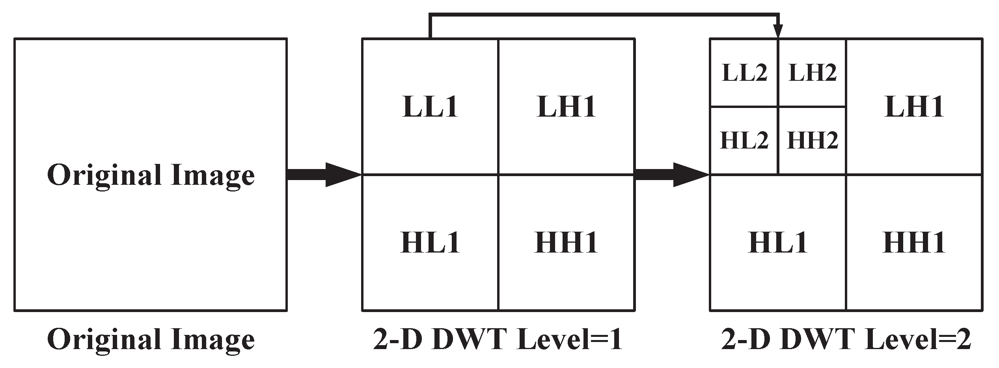

```{r setup, include=FALSE}
knitr::opts_chunk$set(echo = TRUE)
```

## EL ALGORITMO EZW

Vamos a explicar el funcionamiento del algoritmo EZW, uno de los más importantes pues además sirve de base para uno de los algoritmos de compresión más exitosos que es en realidad una versión más refinada del que vamos a describir.

La idea inicial, es que partiendo de una imagen cualquiera (cuadrada), que representamos como una función discreta $I[n,m]$ con $n,m \in \{1, \dots, N\}$, aunque es más fácil imaginarla como una matriz:
$$
\begin{pmatrix}
I[1,1] & I[1,2] & I[1,3] & \cdots & I[1,N] \\
I[2,1] & I[2,2] & I[2,3] & \cdots & I[2,N] \\
I[3,1] & I[3,2] & I[3,3] & \cdots & I[3,N] \\
\vdots & \vdots & \vdots & \ddots & \vdots \\
I[N,1] & I[N,2] & I[N,3] & \cdots & I[N,N]
\end{pmatrix}
$$

Le aplicamos una transformada wavelet a la imagen, con una wavelet madre de nuestra elección $\psi$. Entonces se obtiene la transformada discreta, que es otra matriz $W[n,m]$ de la misma dimensión que la imagen original.

Ahora, si recordamos la matriz de la transformada puede dividirse en cuatro zonas. Recordemos que al hacer la transformada hemos cambiado de dominio, de un dominio espacial hemos pasado al dominio frecuencia, y tenemos dos frecuencias, $\mu$ y $\nu$. Entonces las cuatro zonas son las siguientes:

- HH(_High High_) es la parte de la matriz donde los valores de $\mu$ son **altos** y de $\nu$ son **altos**.
- HL(_High Low_) es la parte de la matriz donde los valores de $\mu$ son **altos** y de $\nu$ son **bajos**.
- LH(_Low High_) es la parte de la matriz donde los valores de $\mu$ son **bajos** y de $\nu$ son **altos**.
- LL(_Low Low_) es la parte de la matriz donde los valores de $\mu$ son **bajos**y de $\nu$ son **bajos**.

En general para una imagen la información más importante se encuentra en la zona LL de la matriz, las demás zonas también pueden contener información relevante aunque lo que contienen esos coeficientes wavelet está más relacionado con los detalles de la imagen como los bordes de los objetos etc. Por tanto es posible prescindir de algunos de los coeficientes de las bandas más altas sin perder mucha información de la imagen original, lo cual nos permitirá almacenar la transformada en menos espacio.

Entonces, según cómo hayamos centrado la matriz (_shift_) los coeficientes o la banda LL se encontrará en la esquina superior izquierda o en la esquina inferior izquierda. Nosotros supondremos que los coeficientes LL se encuentran en la esquina superior izquierda.



### Codificación

La idea para comprimir una imagen es tomar su transformada wavelet y codificarla, permitiendo que se pierda algo de información en el proceso. Esto es, vamos a almacenar algunos de los valores de la matriz de coeficientes, luego veremos bajo qué criterio se hace esto.

Y almacenaremos una aproximación de los coeficientes en vez del valor original.

Así con los coeficientes restantes haremos la transformada inversa y obtendremos una imagen que si elegimos bien los coeficientes que deseamos guardar y lo que no, será casi igual a la original y ocupará mucho menos espacio.

El algoritmo EZW nos dirá cuales son los coeficientes que debemos guardar y la aproximación que hacemos de estos.

### Árboles

Antes de empezar con el algoritmo en si mismo, debemos explicar una estructura de árbol que presentan las matrices de los coeficientes wavelet. 

Lo primero que tenemos es la matriz de coeficientes que podemos llamar $LL_0$, la cual suponemos que su longitud es potencia de $4$, es decir, $N=4^k$ para algún $k$. La matriz $LL_0$ se divide en $4$ partes $LL_1, LH_1, HL_1, HH_1$, a su vez la matriz $LL_1$ puede volver a dividirse en cuatro partes $LL_2, LH_2, HL_2, HH_2$ y así se puede repetir $k$ veces hasta que $LL_k, LH_k, HL_k, HH_k$ sean matrices de $1 \times 1$, en cuyo caso se detiene el proceso de división.

Entonces, vamos a definir un árbol con los coeficientes de la siguiente manera:

- **La raíz del árbol es el coeficiente presente en $LL_0$**
- Dado un coeficiente (que será un nodo del árbol) sus descendientes serán $4$. Si tenemos un coeficiente que se encuentra en la casilla $(i,j)$ de la matriz, sus descendientes directos son los coeficientes que se encuentran en las posiciones $(2i,2j)$, $(2i+1, 2j+1)$, $(2i+1, 2j)$ y $(2i, 2j+1)$. 

Es decir, el coeficiente $W[i,j]$ tiene como descendientes a los coeficientes $W[2i, 2j]$, $W[2i+1, 2j+1]$, $W[2i+1, 2j]$, $W[2i, 2j+1]$.

Si resulta que los coeficientes $W[2i, 2j]$, $W[2i+1, 2j+1]$, $W[2i+1, 2j]$ o $W[2i, 2j+1]$ no existen, porque caen fuera de nuestra matriz, eso significa que nuestro nodo no tiene hijos, es decir es lo que se llama una hoja del árbol.

### Barrido de Morton

_Falta explicar_

### Algoritmo:

El algoritmo EZW se tiene una estructura muy clara. Se hacen varias iteraciones y en cada una de ella hay dos pasos, el paso dominante y el paso subordinado, que después explicaremos con detalle, pero la idea es:

1. Tomar un $T = T_0$, que será lo que llamemos cota de significancia.
2. Realizamos el paso dominante con la cota $T$.
3. Realizamos el paso subordinado con la cota $T$.
4. Se actualiza $T$ como la mitad de su valor anterior, es decir, $T = T_k / 2$.
5. Si $T>1$ hay que repetir desde el paso $2$ con la nueva cota actualizada. Si $T=1$ parar el algoritmo.

#### Paso dominante

El paso dominante siempre es igual para todas las cotas $T$ que podamos tomar, así que $T$ será una cota cualquiera que nos será dada de antemano.

Empezamos por recorrer la matriz siguiente el algoritmo de Morton (o cualquier otro con las mismas propiedades). Entonces se toma un coeficiente wavelet $W[i,j]$ y se hace lo siguiente:

1. Comprobar si $|W[i,j]| > T$.
  - **Si es cierto**, el coeficiente se marca como que es significativo, si es positivo se marca con un signo $+$ y si es negativo con un $-$. Se pasa al siguiente coeficiente.
  - **No es cierto**, entonces es no significativo, entonces hay que comprobar si tiene algún descendiente significativo. Esto es, se comprueba si alguno de sus coeficientes hijos cumple ser mayor, en valor absoluto, que la cota $T$. Hay dos opciones:
  
      1. Hay al menos un hijo significativo, entonces el coeficiente $W[i,j]$ se marca como _IZ_ o _Isolated Zero_ (cero aislado).
      2. Ninguno de los hijos es significativo, entonces repetimos el proceso con los nietos (hijos de los hijos). 
Si de nuevo con los nietos no hay ninguno significativo se prueba con la siguiente generación, hasta que no haya más descendientes que comprobar o hasta que se encuentre un coeficiente significativo. Entonces:

- Si hay algún descendiente significativo se marca el coeficiente como _IZ_
- Si todos los descendientes son no significativos se marca como _ZR_ o _Zero Root_.

A la hora de hacer este paso hay que tener en cuenta que **NINGÚN COEFICIENTE SE COMPRUEBA DOS VECES**. Es decir, si estamos haciendo el algoritmo y tenemos un coeficiente que en el pasado ya hemos comprobado si es significativo o no, porque es hijo de un nodo que ya hemos clasificado, entonces pasamos al siguiente coeficiente, no volvemos a repetir el proceso.

También hay que decir que hay coeficientes que no se revisan. Más concretamente, si nos encontramos realizando la segunda iteración del algoritmo, los coeficientes que en la primera iteración se clasificaron como significativos no se analizan en la segunda iteración.

Más generalmente, en la iteración $k$, no se analizan los coeficientes que se clasificaron como significativos en alguna de las iteraciones anteriores.

#### Paso subordinado

Ahora lo que tendríamos si hiciéramos el algoritmo a mano es una lista con las etiquetas que les hemos puesto a los coeficientes wavelet de la matriz, que hemos analizado. Entonces para los coeficientes que han sido clasificados como significativos **en esta iteración** hacemos:

Se toma el intervalo $[T, 2T]$, el cual dividimos en dos partes $[T, \frac{3}{2}T)$ y  $[\frac{3}{2}T, 2T)$. Entonces, hay dos opciones:

1. El valor absoluto del coeficiente wavelet cae en la mitad inferior del intervalo $[T, 2T)$, entonces aproximamos el valor original por el punto medio del intervalo $[T, \frac{3}{2}T)$, que es $\frac{5}{4}T$.

2. El valor absoluto del coeficiente cae en la mitad superior de $[T, 2T)$, entonces el valor del coeficiente se aproxima, de nuevo, como el punto medio de $[\frac{3}{2}T, 2T)$, que es $\frac{7}{4}T$.

Por tanto, el valor que guardamos es será $\pm \frac{5}{4}T$ o $\pm \frac{7}{4}T$, donde el signo depende del signo del coeficiente.

Pero hay una cosa que no hemos explicado y es ¿por qué el coeficiente wavelet no puede ser mayor que $2T$? Bueno, eso es por la elección que haremos de la cota. Veremos a continuación como elegir los valores de $T$ para que nunca se pueda dar esa situación.

### Desarrollo del algoritmo:

Lo primero es que tenemos tenemos nuestra matriz de coeficientes wavelet, dividida según la jerarquía que hemos dicho antes de las bandas. Entonces, para hacer la primera iteración del algoritmo debemos tomar una primera cota $T_0$. La forma de tomarla garantizando que todos los coeficientes $W[i,j]$ cumplen que $|W[i,j]| < 2T_0$ es:
$$
T_0 := 2^{\lfloor \log_2(\max( | W[i,j] | )) \rfloor}
$$

Entonces, el desarrollo normal del algoritmo sería:

1. Hacemos la primera iteración tomando como cota $T=T_0$, lo cual incluye hacer el paso dominante y el subordinado.
2. Se reduce la cota, se define $T_1 = T_0/2$.
3. Se hace la segunda iteración $T=T_1$.
Se repite hasta que la cota sea $1$.

## Implementación de EZW

A la vista de la descripción que hemos hecho del algoritmo, es claro que la implementación no sería nada fácil si decidiéramos hacerlo por nuestra cuenta. Además tras leer la biografía hay un infinidad de pequeños trucos que hacen que se puede hacer una implementación del algoritmo que sea computacionalmente eficaz.

Sin embargo todo esto solo haría el código más difícil de leer e interpretar, además de que sería muy extenso.

# ALGORITMO SPIHT

Tras explicar el algoritmo EZW podemos pasar al SPIHT, el cual es una versión más refinada del anterior, y mantiene muchas similitudes, así que muchos de los conceptos vistos anteriormente los volveremos a ver. En concreto:

- La idea básica de los dos algoritmos es la misma, comprobar todos los coeficientes wavelets y decidir cuales son significativos y cuales no. Y codificar esa información de manera eficiente.

- La estructura de árbol, con los coeficientes padres e hijos.

- Los coeficientes están ordenados según un cierto orden, que indica la forma en la que recorremos o comprobamos los coeficientes. Ese orden puede ser el de Morton, o cualquier otro con las mismas propiedades, pero hay que tener en cuenta que hay un cierto orden.

- Al igual que en EZW, el algoritmo SPIHT realiza varias iteraciones, y para esas iteraciones se fija una cota $T$, que a cada paso se reduce a la mitad.

- Cada iteración tiene también dos fases o pasos, un paso dominante y otro subordinado.

Para explicar el algoritmo haremos igual que en la sección anterior. Primero explicaremos cada uno de los pasos que componen cada iteración, primero el paso dominante y luego el paso subordinado. Una vez entendidos, pasaremos a los detalles menores, pero también importantes.

## Notación

Vamos a dar un par de definiciones, que nos ahorraran algo de escritura en el futuro. Entonces si tenemos una matriz coeficientes wavelets con dimensión $N \times N$, y $N$ múltiplo de $4$ y se toman $i,j \in \{1, \dots, N\}$, de forma que $(i,j)$ es una posición dentro de la matriz. Entonces:

- $D(i,j)$, denota el **conjunto de los coeficientes descendientes** del coeficiente $(i,j)$

- $C(i,j)$, es el **conjunto de todos los hijos**, es decir $C(i,j) = \{(2i-1, 2j-1), (2i-1,2j), (2i, 2j-1), (2i,2j)\}$.

- $G(i,j)$, es el conjunto de **los descendientes de $(i,j)$, que NO son hijos suyos**.

## Paso dominante SPIHT

La primera diferencia entre los dos algoritmos es que el SPIHT introduce tres elementos nuevos que nos ayudaran a organizar el orden en el que comprobamos la significancia de los coeficientes. Entonces tenemos, tres listas:

- **LIS**(_List of Insignificant Sets_): es una lista donde se incluirán conjuntos de coeficientes que no son significativos. Más concretamente solo puede haber dos conjuntos $D(i,j)$ o $G(i,j)$, para una cierta posición $(i,j)$. 

Sin embargo para ahorrar espacio y simplificar tanto la escritura como la notación, fijaremos el convenio siguiente: la lista LIS no contendrá conjuntos, sino índices; además un índice $(i,j)$ puede ser de dos tipos, $G$ o $D$.

  - Si $(i,j)$ está en LIS **y es de tipo** $D$, entonces, es porque el conjunto $D(i,j)$ está en LIS.

  - Si $(i,j)$ está en LIS **y es de tipo** $G$, entonces, es porque el conjunto $G(i,j)$ está  en LIS.

- **LIP**(_List of Insignificant Pixels_): es la lista de coeficientes no significativos.

- **LSP**(_List of Significant Pixeles_): es la lista de coeficientes significativos.

Entonces, para que la explicación sea más sencilla, no nos vamos a preocupar de donde provienen las tres listas antes mencionadas. Supondremos que son tres listas que vienen dadas de antemano. Posteriormente veremos en detalle cómo se toman las lista anteriores para inicializar el paso dominante.

También hay que decir que el paso dominante requiere tomar un valor $T$ que como ya dijimos servirá para medir la significancia. Supondremos que este $T$ está fijado de antemano y no nos preocuparemos de él hasta más tarde. Lo único que diremos es que la lista LSP siempre empieza vacía, esto es diferente según algunas implementaciones del algoritmo, pero de esta forma se puede entender más fácilmente.

1. **PRIMERO:** Hay que recorrer la lista **LIP**

Para cada $(i,j) \in$ LIP hacemos:

- Si $|w[i,j]| \geq T$, entonces codificamos $\pm1$, en función del signo del coeficiente, y después se elimina el elemento de la lista LIP y se coloca en LSP.
  
- Si $|w[i,j]| < T$, entonces se codifica un $0$.

2. **SEGUNDO:** Hay que recorrer la lista **LIS**

Para cada $(i,j) \in$ LIS distinguimos casos:

- El índice $(i,j)$ es de tipo $D$. Entonces hay dos posibilidades:

  - Todos los descendientes de $(i,j)$ son NO significativos. Entonces se codifica un $0$.
  
  - Hay al menos un descendiente de $(i,j)$ que es significativo. Entonces hay que hacer lo siguiente:
  
    Para cada $(k,l) \in C(i,j)$ (es decir, recorremos la lista de hijos de $(i,j)$) y para cada     un se distinguen dos casos:
      - Si $|w[k,l]| < T$, entonces se añade el índice $(k,l)$ a la lista LIP.
      - Si $|w[k,l]| \geq T$, entonces se añade $(k,l)$ a la lista LSP y se codifica $\pm1$ en          función del signo del coeficiente.
  
  Después de la comprobación anterior, hacemos otra comprobación:
  
  - Si $G(i,j) = \varnothing$ (es decir, el coeficiente $(i,j)$ no tiene más descendientes a parte de los hijos), en cuyo caso se toma $(i,j)$ y se deja en LIS pero ahora se le cambia el tipo de $D$ a $G$.
  
  - Si $G(i,j) \neq \varnothing$ (es decir, el coeficiente $(i,j)$ sí que tiene descendientes a parte de los hijos), en cuyo caso se elimina de el índice $(i,j)$ de LIS.

- El índice $(i,j)$ es de tipo $G$.Entonces se hace la siguiente distinción:
  - Si todos los coeficiente de $G(i,j)$ son NO significativos se codifica un $0$.
  - Si existe algún coeficiente de $G(i,j)$ significativo, entonces añadimos todos los hijos de $(i,j)$ como elementos de LIS y además se guardan como elementos de tipo $D$.
  
FIN DEL PASO DOMINANTE.

## Paso subordinado SPIHT

Este paso es casi exactamente igual que en el algoritmo anterior, la idea es tomar los coeficientes wavelet que son significativos respecto de la cota $T$ y hacemos una aproximación de ellos para ahorrar espacio en memoria.

La cosa es que los coeficientes que son significativos respecto de la cota $T$ son los que tras el paso dominantes se encuentran en la lista LSP. Por tanto el paso subordinado se puede describir como:

Para cada $(i,j) \in$$LSP:

1. Si $|w[i,j]|$ cae en la mitad inferior del intervalo $[T, 2T)$, entonces aproximamos el valor original por el punto medio del intervalo $[T, \frac{3}{2}T)$, que es $\frac{5}{4}T$.

2. Si $|w[i,j]|$ cae en la mitad superior de $[T, 2T)$, entonces el valor del coeficiente se aproxima, de nuevo, como el punto medio de $[\frac{3}{2}T, 2T)$, que es $\frac{7}{4}T$.

Luego a la aproximación se le pone el mismo signo que el coeficiente.

## Primera iteración

Para el paso dominante los conjuntos LIS y LIP vienen dados por la iteración anterior. Es decir, para comenzar el paso dominante de la iteración $k$ se toman los conjuntos LIS y LIP tal y como quedaron tras el paso dominante de la la iteración $k-1$.

Entonces la pregunta que queda por resolver es cuáles son los conjuntos LIS y LIP para comenzar la primera iteración. Bien la respuesta es simplemente tomar el primer índice $(1,1)$ como el único elemento en LIS, que se guardará como tipo $D$; la lista LIS se tomará vacía.

Para la elección de la cota se hace lo mismo que en el algoritmo anterior:
$$
T_0 := 2^{\lfloor \log_2(\max( | W[i,j] | )) \rfloor}
$$
### ¿Cómo serían las primeras iteraciónes?

Dada la dificultad del algoritmo y los extenso que es, consideramos que puede ayudar explicar como sería la primera iteración del algoritmo. Entonces recordamos, primero realizamos el paso dominante con los siguientes datos iniciales:

- $T_0 := 2^{\lfloor \log_2(\max( | W[i,j] | )) \rfloor}$.

- LSP$= \varnothing=$LIP.

- LIS$=\{((1,1), H)\}$.

Lo primero que deberíamos hacer es recorrer la lista LIP, pero como está vacía, podemos saltar este paso.

Después recorremos la lista LIS. Solo hay un índice, y está guardado como tipo $H$, así que lo siguiente que tenemos que hacer es comprobar si tiene descendientes significativos, que por la forma en la que hemos elegido la cota $T_0$ es seguro que los tendrá.

Por tanto el siguiente paso es comprobar cuales de sus hijos son significativos, lo que lo sean se guardarán en la lista LPS y se codificaran con su signo.

Tras esto se comprueba si el índice $(1,1)$ tiene nietos, en general, a menos que la imagen sea de $4 \times 4$ píxeles, los tendrá, por tanto lo que haremos es guardar de nuevo el índice $(1,1)$ en la lista LIS pero ahora como tipo $G$. Terminando el primer paso dominante.

Se realiza el paso subordinado, y se reduce la cota a la mitad.

Entonces, pasamos a la segunda iteración. Recorreríamos, de nuevo, la lista LIS, como solo tiene el elemento $(1,1)$ lo siguiente que haríamos es comprobar si sus descendientes no hijos son significativos respecto de la cota nueva cota. Si no los hubiera acabaría la iteración.

En caso contrario, tomaríamos los descendientes de $(1,1)$, estos son $(1,2)$, $(2,2)$ y $(2,1)$, los añadiríamos a la lista $LIS$ como elementos de tipo $H$.

Tras esto se reduce la cota a la mitad y se continua con el algoritmo.

### Otra forma de inicializar el algoritmo

Podríamos elegir otra forma de inicializar el algoritmo que nos podría ahorrar una iteración, aunque a largo plazo sería lo mismo. La única diferencia respecto de la inicialización descrita antes sería en los conjuntos LIS y LIP.

La idea sería tomar:

- LIS$= \{((1,2), H), ((2,2), H), ((2,1), H)\}$.

- LIP$=\{(1,1), (1,2), (2,1), (2,2)\}$.

Con esta inicialización ahorraríamos la primera iteración del algoritmo anterior y el resultado sería el mismo.

